# Interacting with Log Files using gRPC and REST API

### Tasks
1. Create a client program that uses gRPC to invoke a lambda function deployed on AWS to determine if the desired timestamp is in the log file
2. Create a client program and the corresponding lambda function that use the REST methods (e.g., GET or POST) to interact

### Technologies Used

1. **Scala** - To create gRPC client and server code and REST client
2. **AWS EC2** - For scheduling LogGenerator on a daily basis
3. **AWS Lambda** - To find if input time interval exists in the log file and if yes, return the count of logs with the regex pattern
4. **AWS API Gateway** - To create REST APIs that will interact with the lambda function
5. **AWS CloudWatch** - To debug the logs generated by the lambda function

### Log File Info

Log files are generated on a daily basis for 20000 entries from `02:40:31` to `02:59:18`

### AWS API URL

https://8ad0drhi73.execute-api.ca-central-1.amazonaws.com/dev/

### Endpoints Used

1. **GRPC** - /GRPC
2. **GET**  - /getLogCount
3. **POST** - /postLogCount
4. **test using GET** - /test  

## Steps to Execute

### Integration tests

`sbt clean compile test`

### For gRPC

1. Clone the repository from Github. Traverse to the root directory of the project
2. Run the command `sbt clean compile run` and choose option 2 to start the GRPC server
3. In a separate tab, under the same root folder location, run the command `sbt "runMain Clients.GRPCClient 02:47:30,00:03:15"`
4. In the above command, 02:47:30 is the input time and 00:03:15 is the delta

**NOTE**: If there is an error that port already in use, please use the following commands:
1. lsof -i:50070
2. kill -9 `<pid>`

### For REST API

#### Using Terminal(Only GET Request)

1. Run the command `sbt "runMain Clients.RESTClient 02:47:30,00:03:15"`

#### Using Postman

------For GET Request-------

1. Paste `https://8ad0drhi73.execute-api.ca-central-1.amazonaws.com/dev/getLogCount?time=02:50:00&delta=00:00:30` into the URL and select GET Request and hit Send

------For POST Request-------

1. Paste `https://8ad0drhi73.execute-api.ca-central-1.amazonaws.com/dev/postLogCount` into the URL
2. Paste the following payload in Body in raw form `{
"time" : "02:47:04",
"delta" : "00:03:37"
}`
3. Under Headers, set Content-Type to `application/json`
4. Hit Send

### For Testing

1. Paste `https://8ad0drhi73.execute-api.ca-central-1.amazonaws.com/dev/test?time=02:47:04&delta=00:03:37` into the URL and select GET Request and hit Send

## Development steps
* Implementing Lambda & its API
  * Created Lambda function `lambda.py`
  * Created API Gateway to Lambda method, then tested from Postman
  
* Implementing gRPC in Scala
  * Installed `scalapb` and created `.proto` file
  * Implemented local gRPC client-server in Scala using `ScalaPB`. Client & server are able to exchange basic String messages

* Implemented daily scheduler for Log generation
  * Created EC2 instance
  * Installed Java and sbt
  * Copied the Log Generator Code to EC2 instance
  * Created `dailyJob.sh` to run the job and copy to S3 bucket
  * Scheduled the job for daily run in crontab

## Outputs

Starting the GRPC server

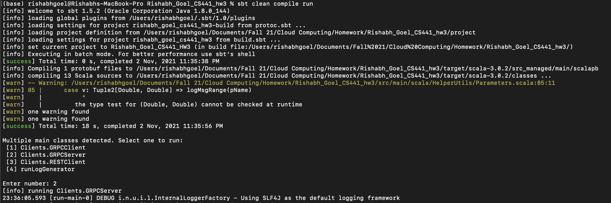

----------

Running GRPC client for successful time interval

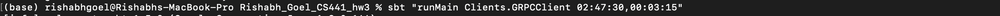

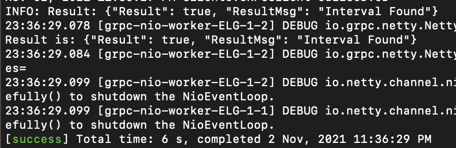

----------

Running GRPC client for unsuccessful time interval

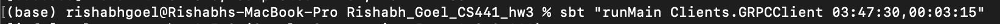

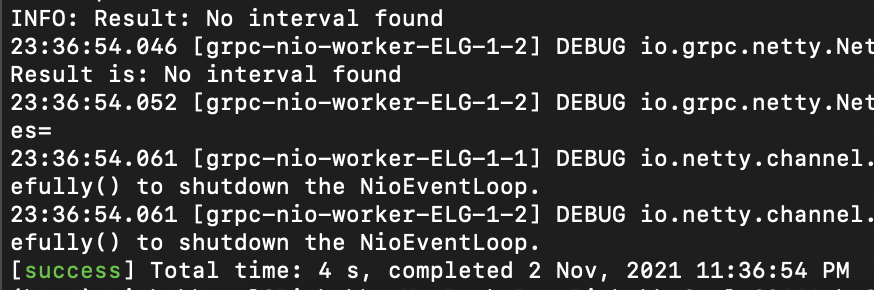

----------

Running REST client for successful time interval

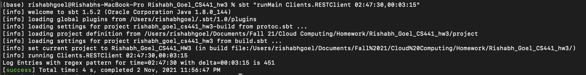

----------

GET Request using Postman with Custom HTTP Code

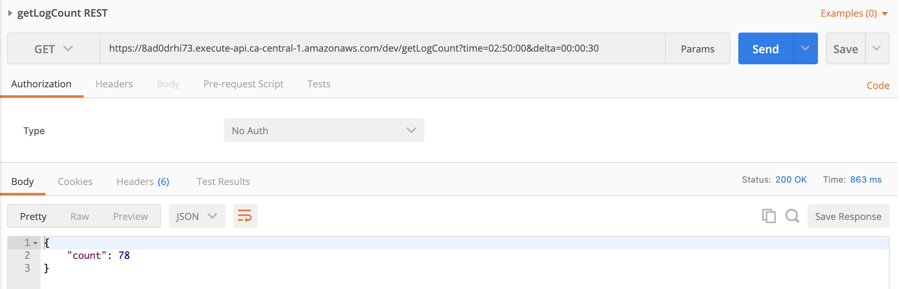

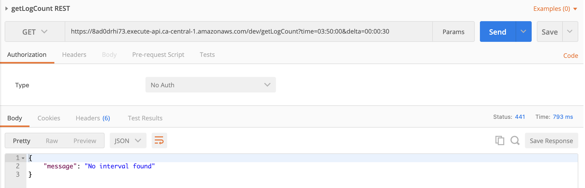

----------

POST Request using Postman with Custom HTTP Code

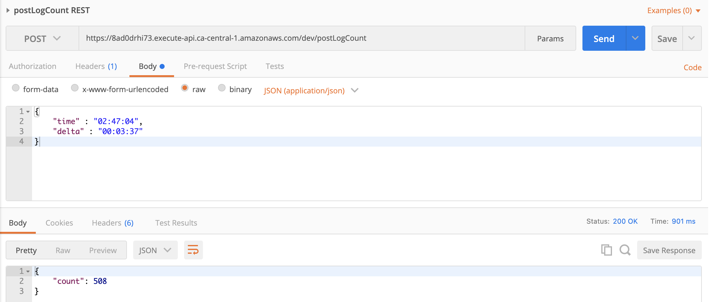

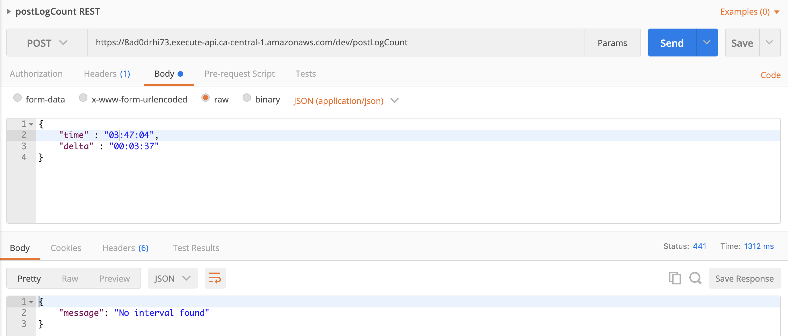

----------

Test Request using Postman with Custom HTTP Code

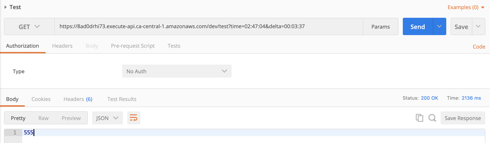

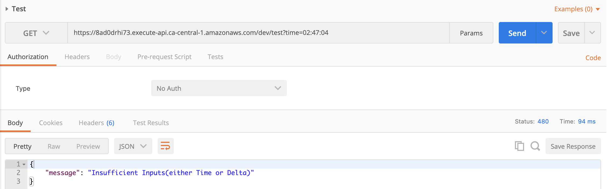

----------

## Demo

You can refer to the [link](https://www.youtube.com/playlist?list=PL8r3CFbbNLMiCMEi-NcV02X65L8QGW-42) to get the demo of the entire project.
